# WSPR receiver on Raspberry PI

WSPR (pronounced "whisper") stands for "Weak Signal Propagation Reporter". It is a protocol, implemented in a computer program, used for weak-signal radio communication between amateur radio operators. The protocol was designed, and a program written initially, by [Joe Taylor, K1JT](https://en.wikipedia.org/wiki/Joseph_Hooton_Taylor_Jr.). Software is now open source and is developed by a small team. The program is designed for sending and receiving low-power transmissions to test propagation paths on the MF and HF bands.

WSPR implements a protocol designed for probing potential propagation paths with low-power transmissions. Transmissions carry a station's callsign, Maidenhead grid locator, and transmitter power in dBm. The program can decode signals with S/N as low as −28 dB in a 2500 Hz bandwidth. Stations with internet access can automatically upload their reception reports to a central database called WSPRnet, which includes a mapping facility.

We will mainly work on the receiving WSPR transmissions here but the Raspberry Pi can also be used as [WSPR beacon](https://tapr.org/?p=5339).

## Insall rtl-sdr

It seems that the newest kernel includes a DVB driver for the dongle as a TV receiver. We do not require this for our purposed so we will create a config file to blacklist it.

## Multiple band switching with cron jobs

 1. Update and add the information in ```environment.sample``` file to ```/etc/environment```. This makes the environment variable accessible to the scripts executed by cron.

```bash
CALL="K0DEV"
GAIN="-a 1"
LOCATOR="FM18jv"
WSPR_RECV_PATH="/home/pi/wspr-receiver"
LOGPATH="$WSPR_RECV_PATH/wsprd-log/wsprd"
RTLSDR_WSPRD_PATH="/home/pi/rtlsdr-wsprd"
```

 1. Add the entries in the ```crontab.sample``` by executing the command ```sudo crontab -e```

## Experimental EST timezone times

```mermaid
gantt
    title Optimal Transmission Times for Each Band (EST & UTC)
    dateFormat  HH:mm
    axisFormat  %H:%M

    section Optimal Times (EST)
    Optimal Window 160 meters :active, 00:00, 06h    
    160 meters :opt1, 00:00, 03h

    Optimal Window 80 meters :active, 00:00, 06h
    80 meters :opt1, 03:00, 03h

    Optimal Window 20 meters :active, 09:00, 09h    
    20 meters :opt1, 16:00, 01h
    Transmit :opt1, 09:00, 01h
    Transmit :opt2, 17:00, 03h

    Optimal Window 60 meters :active, 22:00, 02h
    Optimal Window 61 meters :active, 00:00, 06h        
    60 meters :opt1, 22:00, 02h

    Optimal Window 40 meters :active, 20:00, 4h
    Optimal Window 40 meters :active, 00:00, 9h
    40 meters :opt1, 20:00, 2h

    Optimal Window 30 meters :active, 19:00, 5h
    Optimal Window 30 meters :active, 00:00, 9h
    30 meters :opt1, 06:00, 3h
    
    Optimal Window 15 meters :active, 10:00, 04h
    15 meters :opt1, 10:00, 02h

    Optimal Window 17 meters :active, 10:00, 06h
    17 meters :opt1, 14:00, 01h

    Optimal Window 10 meters :active, 10:00, 04h
    10 meters :opt1, 12:00, 01h

    Optimal Window 2 meters :active, 11:00, 05h
    2 meters :opt1, 15:00, 01h

    Optimal Window 6 meters :active, 10:00, 05h
    6 meters :opt1, 13:00, 01h

    section Optimal Times (UTC)
    Optimal Window 160 meters :active, 05:00, 06h
    160 meters :opt1, 05:00, 03h

    Optimal Window 80 meters :active, 05:00, 06h
    80 meters :opt1, 08:00, 03h

    Optimal Window 20 meters :active, 14:00, 09h
    Transmit :opt1, 14:00, 01h
    Transmit :opt2, 22:00, 03h
    20 meters :opt1, 21:00, 01h
    
    Optimal Window 60 meters :active, 03:00, 02h
    Optimal Window 60 meters :active, 05:00, 06h    
    60 meters :opt1, 03:00, 02h
    
    Optimal Window 40 meters :active, 01:00, 4h
    Optimal Window 40 meters :active, 05:00, 9h
    40 meters :opt1, 01:00, 2h
    
    Optimal Window 30 meters :active, 00:00, 5h
    Optimal Window 30 meters :active, 05:00, 9h
    30 meters :opt1, 11:00, 3h
    
    Optimal Window 15 meters :active, 15:00, 04h
    15 meters :opt1, 15:00, 02h
    
    Optimal Window 17 meters :active, 15:00, 06h
    17 meters :opt1, 19:00, 01h
    
    Optimal Window 10 meters :active, 15:00, 04h
    10 meters :opt1, 17:00, 01h
    
    Optimal Window 2 meters :active, 16:00, 05h
    2 meters :opt1, 20:00, 01h
    
    Optimal Window 6 meters :active, 15:00, 05h    
    6 meters :opt1, 18:00, 01h
```



## Transmit

[Wsprrypi](https://github.com/sharjeelaziz/wsprrypi)

## References

- [TAPR WSPR on 20, 30 and 40 Meters](https://tapr.org/?p=5339)
- [Stratum-1-Microserver HOWTO](https://www.ntpsec.org/white-papers/stratum-1-microserver-howto/)
- [rtl-sdr](https://osmocom.org/projects/rtl-sdr/wiki)
- [rtlsdr-wsprd](https://github.com/Guenael/rtlsdr-wsprd)
- [Tutorial WSPR reception band change with RTLSDR](https://it9ybg.blogspot.com/2018/02/tutorial-wspr-reception-band-change.html)
